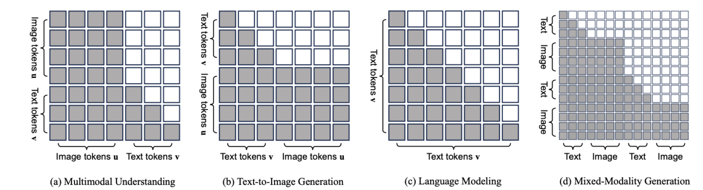
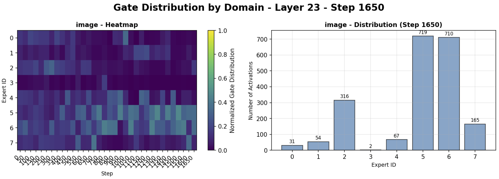
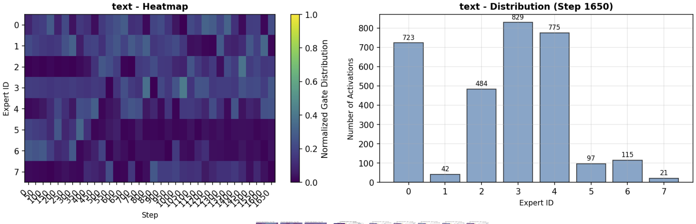
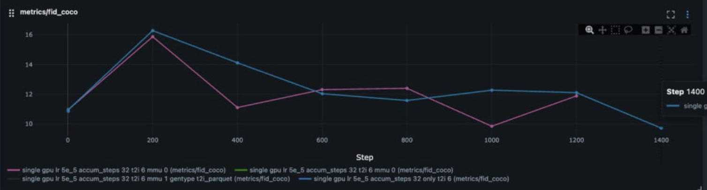
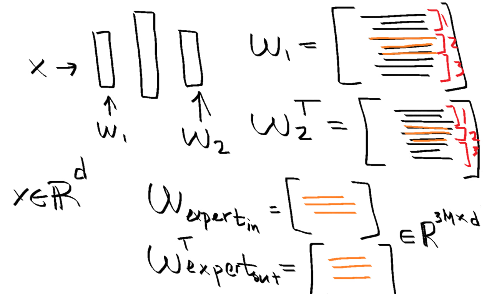
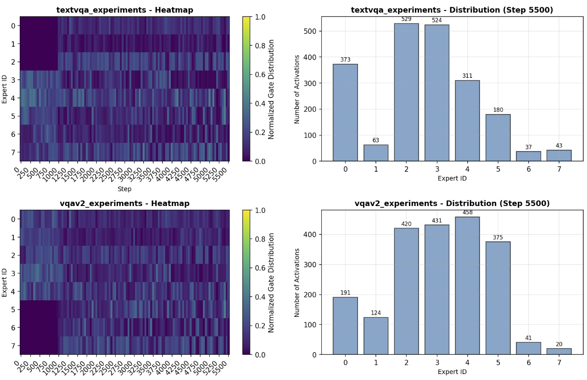
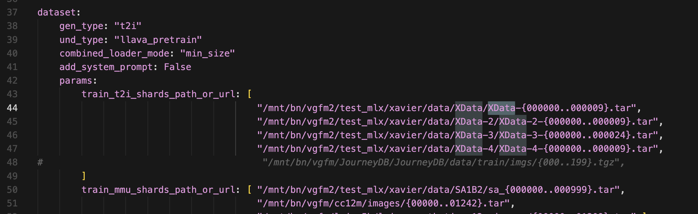
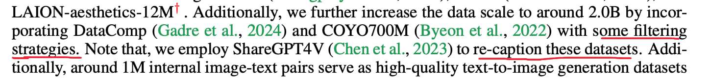

# Investigation of Expert Specialization in Multimodal Diffusion Models

**Authors:** Pavel Vasilev, Daniil Tikhonov  
**Mentor:** Gleb Molodtsov  
**Project:** Yandex School of Data Analysis (YSDA)

---

## 1. Motivation & Problem Statement

Unified multimodal models often struggle because different tasks (e.g., text understanding vs. image generation) require fundamentally different "knowledge" and processing patterns. When all this knowledge is mixed in a single dense Feed-Forward Network (FFN), the model tries to satisfy all objectives simultaneously, often leading to suboptimal performance or "forgetting."

**Our Hypothesis:**  
By replacing dense FFNs with **Mixture of Experts (MoE)** layers, the model can autonomously "route" tokens to specialized experts. We hypothesized the model would separate knowledge based on:
1.  **Token Type:** Image tokens vs. Text tokens.
2.  **Data Domain:** Different underlying datasets.

## 2. Methodology

We experimented with the **Show-o** architecture (1.3B parameters), which unifies Autoregressive (text) and Masked Diffusion (image) modeling.

    
    
<em>Base Model: Show-o Unified Transformer (Xie et al., 2024)</em>

### Approaches Tested
1.  **Naive MoE:** Creating experts by simply copying existing FFN weights.
2.  **Dense-to-MoE (Smart Initialization):** Using **Taylor Scores** to identify important neurons for specific tasks and grouping them into specialized experts (Text Experts, Image Experts, Shared Experts).

### Training the Router
We used a **GShard Gate** with Top-2 selection. To encourage specialization, we employed:
*   **Load Balancing Loss:** With a decaying coefficient ($\alpha \to 0$) to allow specialization after initial training.
*   **Softmax Temperature Annealing:** Starting with high temperature for exploration and cooling down for exploitation.

## 3. Results

### A. Token Separation (Text vs. Image)
We observed a distinct separation of experts handling text and image tokens. The visualizations below show the gating probability distributions for different layers.

    
    

<em>Separation of experts for text and image tokens.</em>

### B. Image Generation Quality (FID)
We compared the Fréchet Inception Distance (FID) of our MoE model against the baseline.
*   **Baseline:** ~9.24
*   **MoE:** ~20

While the FID score increased (indicating lower quality), the model successfully learned to route tokens, proving the concept of autonomous specialization.

    

### C. Initialization with Taylor Scores (Dense-to-MoE)
We attempted to initialize experts by calculating the importance of neurons (Taylor Scores) for text and image tasks.

    
    
<em>Extracting experts from segments based on importance scores.</em>

**Result:** This initialization method improved the **MMU Score** from **62% to 65%**.

## 4. Challenges & Unsuccessful Experiments

### D. Data Domain Separation (Failed)
We hypothesized that the model would separate tokens based on their source dataset (Data Domain), creating specialized "domain experts."
To encourage this, we even introduced a **Learnable Bias** ($b_i(t)$) to the router, which we gradually annealed.

**Outcome:**
Despite our efforts, the model **failed to separate tokens by data domain**. The gating distribution remained mixed across different datasets, suggesting that domain-level specialization is not as "natural" for the model as modality-level specialization (Text vs. Image).

    
    
<em>Gating distribution shows no clear separation by data domain.</em>

### E. Data Quality Issues
We encountered significant challenges with the quality of the training data, which likely impacted the model's ability to learn fine-grained specializations. Issues included:
*   **Poor Captioning:** Many images had irrelevant or generic captions.
*   **Artifacts:** Presence of UI elements, watermarks, or corrupted data in the dataset.

    
    
    

<em>Examples of data quality issues encountered during research.</em>

## 5. Conclusion & Future Work

We explored two approaches to scaling and specializing unified models:
1.  **Scaling (Naive MoE):** Increasing parameter count by copying FFNs. Validated on Text-to-Image (T2I).
2.  **Efficiency (Dense-to-MoE):** Maintaining parameter count by splitting FFNs. Improved Multimodal Understanding (MMU).

**Future Plans:**
*   Use **Sparse Autoencoders (SAE)** to identify semantic features activated by different tokens.
*   Construct experts based on these semantic features for better interpretability.

---
[< Back to Home](./)
